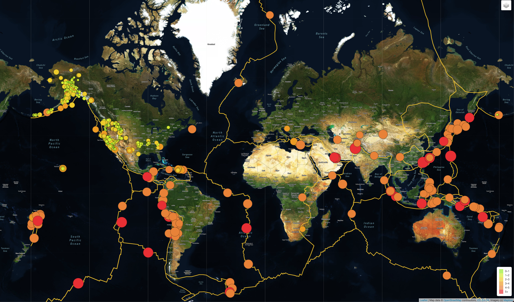

# Mapping_Earthquakes

## Overview
Using Javascript (D3 and Leaflet libraries) to plot data on a Mapbox map, build data visualizations with interactive features, re: earthquakes around the world. 

### Example: 

## Running Locally

* clone repository: `https://github.com/aufdemarbeitsmarkt/Mapping_Earthquakes.git` 
* navigate to corresponding directory 
* run `open Earthquake_Challenge/index.html` in your CLI

Alternatively, after cloning the repository, you may directly open the `../Mapping_Earthquakes/Earthquake_Challenge/index.html` file in your preferred browser, 

